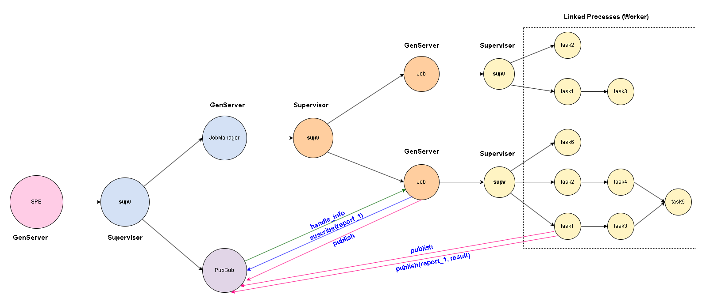

**Project SPE Breakdown**

**Feature 1: SPE Server Core & Setup**

*   **User story 1.1:** As a developer, I want to be able to start the SPE server with configuration options (e.g., `:num_workers`) to control its behavior.
    *   **Work item 1.1.1:** Implement the `SPE` module with the `start_link(options)` function.
    *   **Work item 1.1.2:** Create the main `SPE.Supervisor`.
    *   **Work item 1.1.3:** `SPE.Supervisor` must start and supervise the `JobManager.Supervisor`.
    *   **Work item 1.1.4:** `SPE.Supervisor` must start and supervise the `Phoenix.PubSub` server (registered as `SPE.PubSub`).
    *   **Work item 1.1.5:** Process the `:num_workers` option and store it (probably in the state of the `JobManager` or in a globally accessible `Agent/Registry`).
    *   **Work item 1.1.6:** `SPE.start_link/1` must return `{:ok, pid}` or `{:error, reason}`.
    *   **Work item 1.1.7:** Ensure that the SPE server links to the calling process.
*   **User story 1.2:** As a developer, I want the SPE Server and its main components (JobManager, PubSub) to restart automatically if they fail, to ensure system robustness.
    *   **Work item 1.2.1:** Define appropriate supervision strategies for the children of `SPE.Supervisor` (e.g., `one_for_one` or `rest_for_one`).
    *   **Work item 1.2.2:** Define supervision strategies for `JobManager.Supervisor` (if it directly manages workers or how it manages Jobs).

**Feature 2: Job Submission**

*   **User story 2.1:** As a developer, I want to be able to submit a Job description to the SPE server so that it is registered and prepared for execution.
    *   **Work item 2.1.1:** Implement the `SPE.submit_job(job_description)` function in the `SPE` module.
    *   **Work item 2.1.2:** The `SPE` module must delegate the `submit_job` logic to the `JobManager` (e.g., `GenServer.call(JobManager, {:submit, job_description})`).
    *   **Work item 2.1.3:** `JobManager`: Implement the `handle_call` to process job submissions.
    *   **Work item 2.1.4:** `JobManager`: Validate the syntax of `job_description` (%{"name" => string, "tasks" => list_of_task_maps}).
        *   **Work item 2.1.4.1:** Validate the structure of each task map (presence of "name", "exec", optional "enables", "timeout").
        *   **Work item 2.1.4.2:** Validate that task names within a job are unique.
        *   **Work item 2.1.4.3:** Validate that the task DAG has no cycles (this is complex; initially, it could be a simple validation or assumed correct).
    *   **Work item 2.1.5:** `JobManager`: Generate a unique `job_id` for each submitted job (even if the description is identical). Consider `UUID` or a counter.
    *   **Work item 2.1.6:** `JobManager`: Store the job description and its initial state (e.g., in the state of the `JobManager` or in an ETS table if scaling is necessary). Your diagram suggests that the `JobManager` will maintain the `plan`, `enables`, `values` state per job, which is a good approach for planning.
    *   **Work item 2.1.7:** `JobManager`: Return `{:ok, job_id}` or `{:error, reason}`.
    *   **Work item 2.1.8:** (Refinement of your diagram) `JobManager`: Calculate the initial execution plan (list of task lists by dependency level) and dependencies (`enables` map) at the time of `submit_job`. This facilitates `start_job`.

**Feature 3: Job Execution**

*   **User story 3.1:** As a developer, I want to be able to start the execution of a previously submitted Job using its `job_id`.
    *   **Work item 3.1.1:** Implement the `SPE.start_job(job_id)` function.
    *   **Work item 3.1.2:** The `SPE` module must delegate the `start_job` logic to the `JobManager`.
    *   **Work item 3.1.3:** `JobManager`: Implement the `handle_call` to process job starts.
    *   **Work item 3.1.4:** `JobManager`: Verify that the `job_id` exists and has not been started before.
    *   **Work item 3.1.5:** `JobManager`: Start a new `Job.Supervisor` (or `Job.GenServer`) process as a child, passing it the job description and `job_id`.
    *   **Work item 3.1.6:** `Job.Supervisor/GenServer`: Implement its `init/1` to receive the job description and `job_id`.
    *   **Work item 3.1.7:** `Job.Supervisor/GenServer`: Start executing the first tasks that have no dependencies, respecting the `num_workers` limit (this requires coordination with `JobManager` or a global semaphore/scheduler).
    *   **Work item 3.1.8:** Return `:ok` or `{:error, reason}`.
*   **User story 3.2:** As the SPE system, I want to execute the tasks of a Job according to their dependencies.
    *   **Work item 3.2.1:** `Worker`: Maintain the state of the job (pending tasks, in-progress tasks, completed tasks, failed tasks, accumulated results, remaining plan). Your `plan`, `enables`, `values` diagram is perfect for this.
    *   **Work item 3.2.2:** `Worker`: When a task completes successfully:
        *   **Work item 3.2.2.1:** Store its result in `values`.
        *   **Work item 3.2.2.2:** Identify which new tasks are enabled (their dependencies have been met).
        *   **Work item 3.2.2.3:** Update the `plan` (remove the completed task).
        *   **Work item 3.2.2.4:** Queue/start the newly enabled tasks (coordinating with `num_workers`).
*   **User story 3.3:** As the SPE system, I want to execute tasks concurrently, both within the same job and across different jobs, up to the global `:num_workers` limit.
    *   **Work item 3.3.1:** Design a mechanism for managing `num_workers`.
        *   Option A: `JobManager` acts as a central dispatcher; `Workers` request permission to execute a task.
        *   Option B: A `Registry` or `Agent` that counts active workers. `Workers` attempt to "acquire" a worker slot.
        *   Option C: Use a library like `poolboy` or a `GenStage` to manage a pool of workers.
    *   **Work item 3.3.2:** `Worker`: When a task is ready to execute, request a "worker slot."
    *   **Work item 3.3.3:** `Task Execution`: Each task (`fun`) must execute in its own process (e.g., `Task.Supervisor.start_child` or `spawn_link`).
    *   **Work item 3.3.4:** `Worker`: The `Job` process must monitor the processes of its tasks to detect completions (normal or error).

**Feature 4: Task Lifecycle & Error Handling**

*   **User story 4.1:** As the SPE system, I want each task to execute with the results of the tasks it depends on.
    *   **Work item 4.1.1:** `Worker`: When starting a task, construct the argument map for `fun` by extracting the necessary results from the job's `values` map.
*   **User story 4.2:** As the SPE system, I want to handle timeouts for tasks.
    *   **Work item 4.2.1:** `Task Execution`: When executing `fun`, if it has a numeric `timeout`, use `Task.await(task, timeout)` or a `Process.send_after` to auto-send a timeout message.
    *   **Work item 4.2.2:** `Worker`: If a task exceeds its timeout, it must be considered failed (`{:failed, :timeout}`).
    *   **Work item 4.2.3:** `Task Execution`: Ensure that a task that times out is terminated (e.g., `Process.exit(pid, :kill)`).
*   **User story 4.3:** As the SPE system, I want to handle task crashes without the entire Job or SPE Server crashing.
    *   **Work item 4.3.1:** `Worker`: If a task's `fun` crashes, the process executing it (and monitored by the `Worker`) will send a `DOWN` message.
    *   **Work item 4.3.2:** `Worker`: Capture the crash of a task and register it as `{:failed, {:crashed, reason}}`.
*   **User story 4.4:** As the SPE system, if a task fails (timeout or crash), tasks that depend on it must not execute.
    *   **Work item 4.4.1:** `Worker`: When a task fails, mark all dependent tasks (direct and indirect) as `:not_run`.
    *   **Work item 4.4.2:** `Worker`: Continue executing other tasks in the job that do not depend on the failed task.

**Feature 5: Reporting (Phoenix PubSub)**

*   **User story 5.1:** As the SPE system, I want to notify the termination of each task (successful, timeout, or crash) through PubSub.
    *   **Work item 5.1.1:** `Worker`: When a task (`task_name`) terminates, construct the message `{:spe, time, {job_id, :task_terminated, task_name}}`.
    *   **Work item 5.1.2:** `Worker`: Obtain `time` using `erlang.monotonic_time(:millisecond)`.
    *   **Work item 5.1.3:** `Worker`: Publish the message using `Phoenix.PubSub.local_broadcast(SPE.PubSub, job_id, message)`.
*   **User story 5.2:** As the SPE system, I want to notify the completion of a Job (when all executable tasks have finished) through PubSub.
    *   **Work item 5.2.1:** `Worker`: Determine when a job has finished (no more tasks in the `plan` or the remaining ones are `:not_run`).
    *   **Work item 5.2.2:** `Worker`: Determine the `status` of the job (`:succeeded` or `:failed`).
    *   **Work item 5.2.3:** `Worker`: Construct the final `results` map with the state of each task (`{:result, value}`, `{:failed, :timeout}`, `{:failed, {:crashed, reason}}`, `:not_run`).
    *   **Work item 5.2.4:** `Worker`: Construct the message `{:spe, time, {job_id, :result, {status, results}}}`.
    *   **Work item 5.2.5:** `Worker`: Publish the message using `Phoenix.PubSub.local_broadcast(SPE.PubSub, job_id, message)`.
    *   **Work item 5.2.6:** `Worker`: Once a job has finished and reported, it can terminate its own process. `JobManager` must handle its termination.

**Feature 6: Testing and Documentation**

*   **User story 6.1:** As a developer, I want a test suite (ExUnit) to verify the correct implementation of the API and SPE behavior.
    *   **Work item 6.1.1:** Configure the project to use ExUnit.
    *   **Work item 6.1.2:** Include and ensure that Moodle tests pass without modifications.
    *   **Work item 6.1.3:** Write unit tests for `SPE.start_link`, `SPE.submit_job`, `SPE.start_job`.
    *   **Work item 6.1.4:** Write integration tests for the complete job flow (submit, start, task execution, results).
    *   **Work item 6.1.5:** Write tests for error cases (invalid job_desc, starting job twice, task timeout, task crash).
    *   **Work item 6.1.6:** Write tests for concurrency (multiple jobs, `num_workers` limit).
    *   **Work item 6.1.7:** Write tests to verify PubSub messages.
*   **User story 6.2:** As a developer, I want a clear `README.md` explaining how to configure, build, and test the application.
    *   **Work item 6.2.1:** Document Elixir/Erlang versions.
    *   **Work item 6.2.2:** Document dependencies and how to fetch them (`mix deps.get`).
    *   **Work item 6.2.3:** Document how to run tests (`mix test`).
    *   **Work item 6.2.4:** (If applicable) Document database configuration for extensions.
*   **User story 6.3:** As a team, we want to follow good Git practices.
    *   **Work item 6.3.1:** Create a private Git repository (Gitlab/Github).
    *   **Work item 6.3.2:** Add an `AUTHORS` file.
    *   **Work item 6.3.3:** Add professors as collaborators.
    *   **Work item 6.3.4:** Make small commits with descriptive messages.
    *   **Work item 6.3.5:** Ensure regular commits from all members.

**Feature 7: Logging (Optional but recommended)**

*   **User story 7.1:** As a developer, I want SPE to log important events to facilitate debugging.
    *   **Work item 7.1.1:** Integrate the `Logger` library.
    *   **Work item 7.1.2:** Add logs for: SPE start/stop, job submissions, job starts, task start/end (with result), errors.
    *   **Work item 7.1.3:** Allow configuration of the log level (e.g., `Logger.configure(level: :warning)`).

---

**Possible Extensions (Additional Features):**

**Feature E1: Sleeping Tasks**
*   **User story E1.1:** As a task developer, I want a task to be able to "sleep" (releasing its worker slot) and "wake up" later to continue execution.
    *   ... (Specific WIs for this communication and state management)

**Feature E2: Distributed SPE**
*   **User story E2.1:** As a system operator, I want to connect multiple SPE nodes to distribute the workload.
    *   ...

**Feature E3: Persistence**
*   **User story E3.1:** As a system operator, I want the state of jobs and tasks to be saved to disk so they can be recovered after an SPE server restart.
    *   ...

**Feature E4: Task Priority**
*   **User story E4.1:** As a developer, I want to specify priorities for tasks within a job to influence the execution order.
    *   ...

---

**Recommendations:**

1.  **MVP (Minimum Viable Product):** Focus first on Features 1 to 5 to have the core functionality.
2.  **Iterate:** Implement one User Story (or even one Work Item) at a time. Test, commit, and then move to the next.
3.  **Tools:** Use Trello, Jira, GitHub Issues, or similar to manage these WIs.
4.  **Communication:** Review progress and blockers daily as a team.
